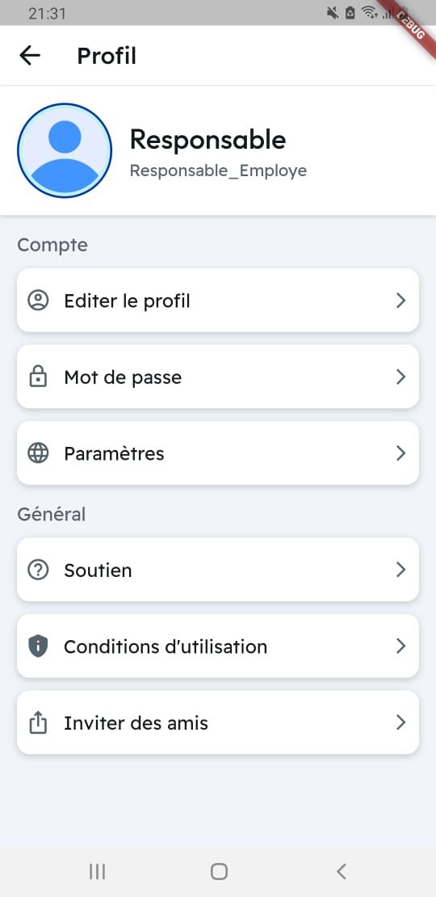
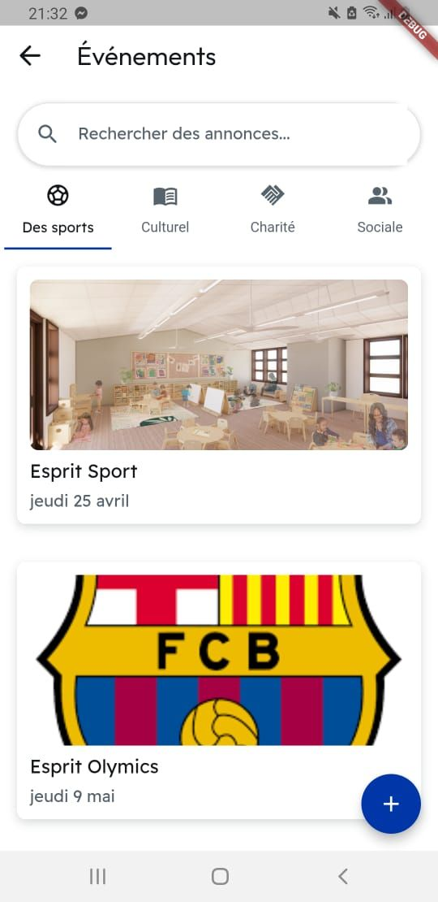
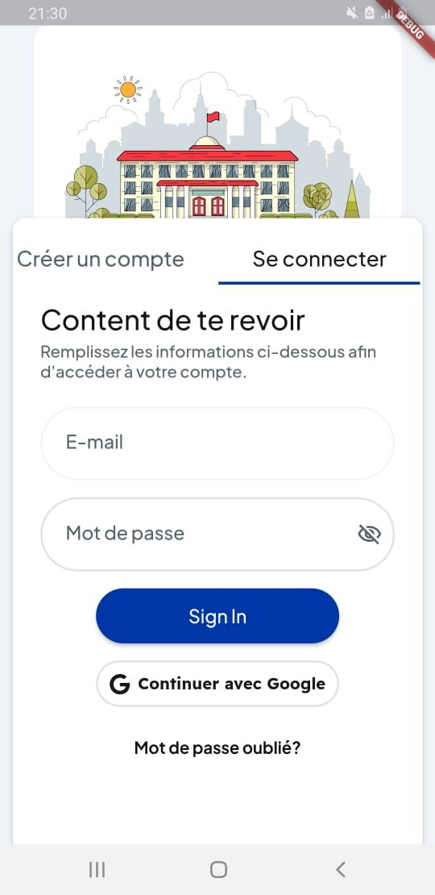
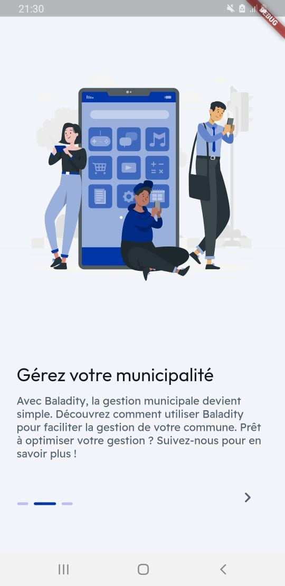

# Baladity

Baladity is a cutting-edge application designed to bridge the communication gap between citizens and their local municipal authorities. Our platform empowers both citizens and municipal employees by providing a streamlined, efficient means of interaction and task management.

Here are some screenshots of our application:

 
 
 
 

This application won't work due to missing the backend folder because it contains secret API keys, If you want to test the app contact me on my LinkedIn account
